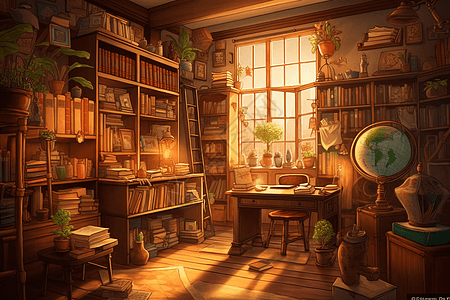

  

<h1 align="center">我的组件库</h1>

我的组件库，是一款基于 Dumi，由 React + TypeScript 开发的轻量级组件库 🎉。

UI 设计方面参考了[Ant Design 组件库](https://ant.design/index-cn)，同时组件的使用方式也会参照 Ant Design 进行实现。这是我复现的版本，目前包含 Button 和 Form 两个核心组件。

## 已完成组件

- ✅ Button 组件
- ✅ Form 组件
